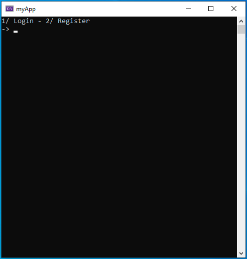

What is Eauth?
==============

https://eauth.us.to/ - Your #1 Free and Powerful Software Licensing Solution, Ultimately providing you with the most secure features and easy to use on an authentication system.    

Terms of Service
----------------
- Cheating or the use of malicious software is not allowed. Read https://eauth.us.to/tos/
  
Documentation
-------------

https://eauth.us.to/docs/


Static Library
-------------

https://github.com/Eauth786/Eauth-CPP-Library

Configuration
-------------

In your `main()` function, the first step is to initiate a request with your credentials:

```cpp
int main() {
    // Initialization request (required)
    if (!initRequest("your_account_key", "your_application_key", "your_application_id", "1.0")) { // --> 1.0 means your app version
        std::cout << error_message;
        std::this_thread::sleep_for(std::chrono::milliseconds(3500));

        // Exit the program to indicate an error
        exit(1);
    }
}
```
